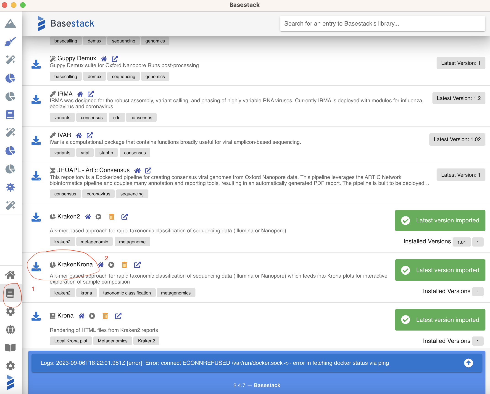
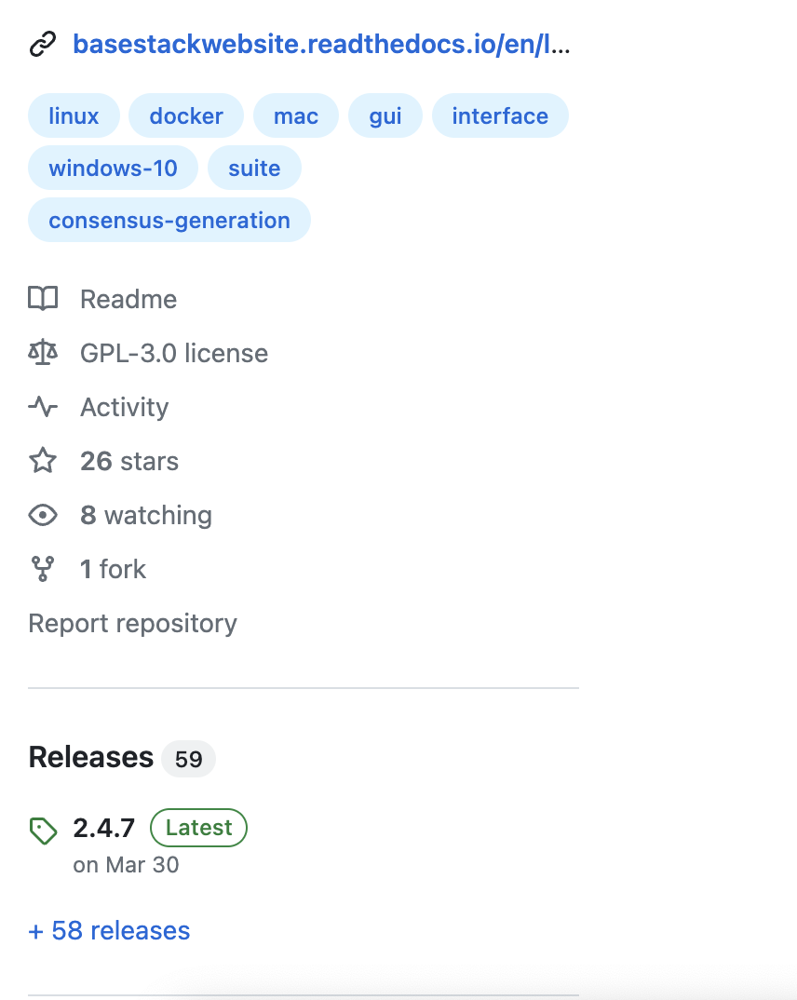
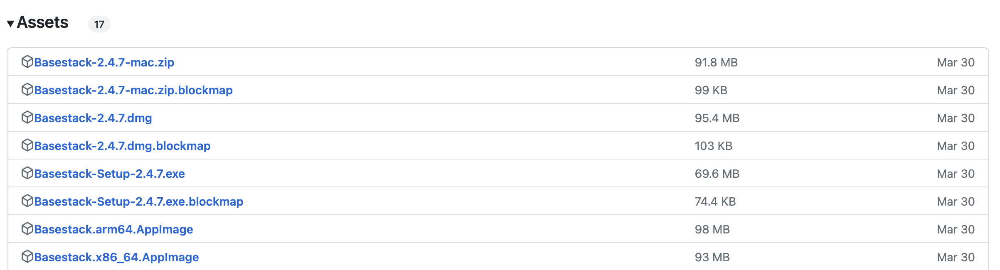

# Advanced Metagenomics Installation

## WSL2 (Windows Only)

Prerequisites: None

1. Open Windows Powershell and type `wsl --version`

If you have something appear you can skip this step, otherwise follow the instructions [here](https://docs.microsoft.com/en-us/windows/wsl/install-win10#step-4---download-the-linux-kernel-update-package)

2. `wsl --install -d ubuntu`

You may need to restart your machine after installing


## Git

### `WSL2` and `Linux`

`sudo apt-get update && sudo apt-get install -y git`

### `Mac`

`brew install git`

* If you dont have brew, install it with: /bin/bash -c "$(curl -fsSL https://raw.githubusercontent.com/Homebrew/install/HEAD/install.sh)"


## Nextflow 

Prerequisites: 

1. Java (OpenJDK)
2. Unix Environment (WSL2 see above for Windows Users)


On Windows, you need to be sure you are running WSL2
Follow the instructions [here](https://www.nextflow.io/docs/latest/getstarted.html) (after installing pre-reqs)

```
curl -s https://get.nextflow.io | bash
chmod +x nextflow
sudo cp nextflow /usr/local/bin/
```

## Docker

Prerequisites: None (But you need Admin Permissions)

[Mac OSX](https://docs.docker.com/desktop/install/mac-install/)

Make sure to select the right processor type. Typically, newer Mac Models are the Apple Silicon option

[Windows](https://docs.docker.com/desktop/install/windows-install/)

You will need admin access to install this

[Linux](https://docs.docker.com/engine/install/ubuntu/)

Make sure to follow the steps in the `post-installation` steps

Or you can follow these commands below. Simply copy and paste them into your terminal


```
# Add Docker's official GPG key:
sudo apt-get update
sudo apt-get install ca-certificates curl gnupg
sudo install -m 0755 -d /etc/apt/keyrings
curl -fsSL https://download.docker.com/linux/debian/gpg | sudo gpg --dearmor -o /etc/apt/keyrings/docker.gpg
sudo chmod a+r /etc/apt/keyrings/docker.gpg

# Add the repository to Apt sources:
echo \
  "deb [arch="$(dpkg --print-architecture)" signed-by=/etc/apt/keyrings/docker.gpg] https://download.docker.com/linux/debian \
  "$(. /etc/os-release && echo "$VERSION_CODENAME")" stable" | \
  sudo tee /etc/apt/sources.list.d/docker.list > /dev/null
sudo apt-get update


sudo apt-get install docker-ce docker-ce-cli containerd.io docker-buildx-plugin docker-compose-plugin


sudo groupadd docker
sudo usermod -aG docker $USER

## only run these commands once (between the ##) as repeat lines can mess up your env. Use nano if you need to edit it and this was run already
sudo sed -i "1s/^/$USER:$(id -u):1\n/" /etc/subuid
sudo sed -i "1s/^/$USER:$(id -g):1\n/" /etc/subgid
sudo apt install jq

echo $(jq --arg user "$USER" '. += {"userns-remap": $user}' /etc/docker/daemon.json) > ~/daemon.json && sudo mv ~/daemon.json /etc/docker/daemon.json

##

```


### Base Install

### Images

Prerequisites: Docker

<!-- Show the imgs/LibraryBasestack.png file -->


Within Basestack, import (little blue button on the left side): 

1. `Pavian`
2. `Mytax Dashboard v2` 
3. `KrakenKrona`
4. `Kraken`
5. `Bowtie2`
6. `TaxTriage` 

Be aware that, for Mac OSX Arm64 systems, there may be issues with the architecture in running these pipelines

## Basestack

Prerequisites: Docker

1. Go to [here](https://github.com/jhuapl-bio/Basestack/releases/latest)
2. Download the latest binary 
    a. Mac OSX: `.dmg`
    b. Windows (non-admin): `win-unpacked.zip`. You will need to extract/unzip and double click the `.exe` each time to run
    c. Windows (admin): `*Setup.exe`
    d. Linux: `AppImage`. Make sure to select `x86_64` (most cases for your laptop)
        - You will need to run `chmod +x` on the AppImage to allow it to be double-clickable. Otherwise run with `./Basestack.x86_64.AppImage`




## Conda 

Prerequisites: None

Ensure that you are INSIDE `WSL2` (see steps above to install). When running the script, select `Enter` or type `yes` when prompted

1. `WSL2` or `Linux`: 

```
cd $HOME
wget https://repo.anaconda.com/miniconda/Miniconda3-latest-Linux-x86_64.sh
bash Miniconda3-latest-Linux-x86_64.sh
```

2. `Mac OSX`

`arm64`

```
cd $HOME
wget https://repo.anaconda.com/miniconda/Miniconda3-latest-MacOSX-arm64.sh
bash Miniconda3-latest-MacOSX-arm64.sh
```

`amd64`

```
cd $HOME
wget https://repo.anaconda.com/miniconda/Miniconda3-latest-MacOSX-x86_64.sh
bash Miniconda3-latest-MacOSX-x86_64.sh
```

### Kraken2 databases

1. [standard-8](https://genome-idx.s3.amazonaws.com/kraken/k2_standard_08gb_20230605.tar.gz)
2. [viral](https://genome-idx.s3.amazonaws.com/kraken/k2_viral_20230605.tar.gz)
3. [flukraken2](https://media.githubusercontent.com/media/jhuapl-bio/mytax/master/databases/flukraken2.tar.gz)


### TaxTriage Trial Run

This process is going to be one of the primary workflows from QC to Assembly, with Kraken2 in the middle for classification of unknown taxa

You will need to use `WSL2` on Windows and ensure you have Nextflow Installed with `Docker`

Open up a terminal and run:

```
nextflow run https://github.com/jhuapl-bio/taxtriage -r main -profile test,docker --outdir ~/test_nfcore
```

this will make a folder called `test_nfcore` in your `$HOME` directory. In there you will see an example output of `taxtriage` that will also contain a small kraken2 database and report file(s), consensus files, a multiqc report

