# Advanced Metagenomics Installation

There are 3 mandatory steps with a fourth if you are using a Windows 10/11 machine

1. [Docker](#docker)
2. [Nextflow](#nextflow)
3. [Basestack](#basestack)
4. [(Only Windows) WSL2](#wsl2-windows-only)

Please click the links to each of the above (or scroll down to them) to start the setup process

Additionally, we have an optional step at the end to install conda. We will NOT be using conda for the workshop, but it is incredibly useful for downloading things in bioinformatics.

Lastly, if there are formatted lines (grey background) for some code lines, there is a button on the righthand side you can click to copy EVERYTHING and then be able to paste it into your terminal.

5. [Conda](#Conda) 


## WSL2 (Windows Only)

Prerequisites: None

1. Open Windows Powershell and type `wsl --version`

If you have something appear you can skip this step, otherwise follow the instructions [here](https://docs.microsoft.com/en-us/windows/wsl/install-win10#step-4---download-the-linux-kernel-update-package)

2. `wsl --install -d ubuntu`
3. Go Back to powershell and type: `wsl.exe --set-default-version 2`

You may need to restart your machine after installing

:warning: please be aware that things in your `C:` drive will be referred to as `mnt/c/`. So, for instance if I want to put something in my `Documents` folder I would need to do `cp test.txt /mnt/c/Users/$USER/Documents/test.txt`. Make sure you select the right value of $USER in that path example. If you're unsure, simply check the username in Windows10 OR you can hit `tab` after `/mnt/c/Users/` and you should see things autopopulate`

Otherwise, if you want to view things through the File Explorer you can do so by following these steps:

### Viewing or adding to your WSL from Windows Explorer

On the left-hand side, you should see the Linux logo in the quick search, near the bottom. Open Windows Explorer (Folder icon) on your Windows 10/11 machine first.

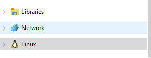

Make sure to select the Distro name. In my case (and yours) it is likely `Ubuntu`
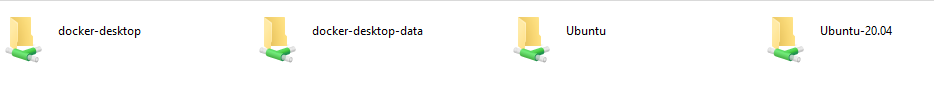

Select `/home/`

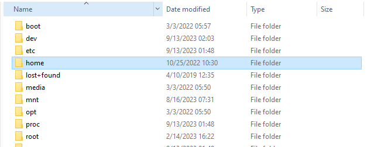

Select the username. There is likely only a single directory within here. In my case, it is merribb1

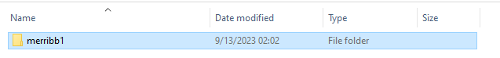

You're now in the `$HOME` of your WSL2 terminal! feel free to browse around. We will access this this way when doing TaxTriage (see further down)

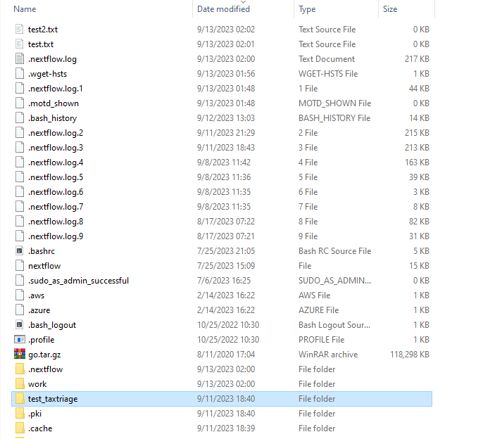

## Git

### `WSL2` and `Linux`

`sudo apt-get update && sudo apt-get install -y git`

### `Mac`

`brew install git`

* If you dont have brew, install it with:
  
```
/bin/bash -c "$(curl -fsSL https://raw.githubusercontent.com/Homebrew/install/HEAD/install.sh)"
```


## Docker

Prerequisites: None (But you need Admin Permissions)

[Mac OSX](https://docs.docker.com/desktop/install/mac-install/)

Make sure to select the right processor type. Typically, newer Mac Models are the Apple Silicon option

[Windows](https://docs.docker.com/desktop/install/windows-install/)

You will need admin access to install this

[Linux](https://docs.docker.com/engine/install/ubuntu/)

Make sure to follow the steps in the `post-installation` steps

Or you can follow these commands below. Simply copy and paste them into your terminal


```
# Add Docker's official GPG key:
sudo apt-get update
sudo apt-get install ca-certificates curl gnupg
sudo install -m 0755 -d /etc/apt/keyrings
curl -fsSL https://download.docker.com/linux/debian/gpg | sudo gpg --dearmor -o /etc/apt/keyrings/docker.gpg
sudo chmod a+r /etc/apt/keyrings/docker.gpg

# Add the repository to Apt sources:
echo \
  "deb [arch="$(dpkg --print-architecture)" signed-by=/etc/apt/keyrings/docker.gpg] https://download.docker.com/linux/debian \
  "$(. /etc/os-release && echo "$VERSION_CODENAME")" stable" | \
  sudo tee /etc/apt/sources.list.d/docker.list > /dev/null
sudo apt-get update


sudo apt-get install docker-ce docker-ce-cli containerd.io docker-buildx-plugin docker-compose-plugin


sudo groupadd docker
sudo usermod -aG docker $USER

## only run these commands once (between the ##) as repeat lines can mess up your env. Use nano if you need to edit it and this was run already
sudo sed -i "1s/^/$USER:$(id -u):1\n/" /etc/subuid
sudo sed -i "1s/^/$USER:$(id -g):1\n/" /etc/subgid
sudo apt install jq

echo $(jq --arg user "$USER" '. += {"userns-remap": $user}' /etc/docker/daemon.json) > ~/daemon.json && sudo mv ~/daemon.json /etc/docker/daemon.json

##

```

## Nextflow 

Prerequisites: 

1. Java (OpenJDK)

To install on WSL2 and Linux, you can get version 17 like: 

`sudo apt update -y && sudo apt install -y openjdk-17-jdk`

Please be aware that this will not install on all OS types. On Mac, you will need to install it from: `brew install java`

If it is installed and you run `java --version` you should see: 

```
openjdk 20.0.1 2023-04-18
OpenJDK Runtime Environment Homebrew (build 20.0.1)
OpenJDK 64-Bit Server VM Homebrew (build 20.0.1, mixed mode, sharing)
```

❕Be aware that the above line is what you should see (the version may be different). It is NOT a command to run!

Please note that the version may vary based on what you've installed. In my case I've installed v20 but you may see v11 or later

2. Unix Environment (WSL2 see above for Windows Users)


On Windows, you need to be sure you are running WSL2
Follow the instructions [here](https://www.nextflow.io/docs/latest/getstarted.html) (after installing pre-reqs)

```
curl -s https://get.nextflow.io | bash
chmod +x nextflow
sudo cp nextflow /usr/local/bin/
sudo chown $USER /usr/local/bin/nextflow
```

If it successfully completes the `curl` command, you will see something like. 

❕This is not a command, but what you should see after you run the above 4 lines of code


```
CAPSULE: Downloading dependency io.nextflow:nf-httpfs:jar:23.04.3
CAPSULE: Downloading dependency io.nextflow:nf-commons:jar:23.04.3
CAPSULE: Downloading dependency io.nextflow:nextflow:jar:23.04.3
                                    
      N E X T F L O W
      version 23.04.3 build 5875
      created 11-08-2023 18:37 UTC (14:37 EDT)
      cite doi:10.1038/nbt.3820
      http://nextflow.io


Nextflow installation completed. Please note:
- the executable file `nextflow` has been created in the folder: /Users/$USER/Downloads
- you may complete the installation by moving it to a directory in your $PATH

```


### TaxTriage Trial Run

This process is going to be one of the primary workflows from QC to Assembly, with Kraken2 in the middle for classification of unknown taxa. By running this upcoming command, you will be able to install all Docker images that correspond to the pipeline. Additionally, you will install a test database (called test_metagenome) along with a basic Samplesheet (which contains information on each of the samples for the pipeline to use) and some simulated Miseq (paired-end) and Oxford Nanopore reads. 

For more information on the datasets, see [here](https://github.com/jhuapl-bio/datasets/tree/main) and for information on taxtriage usage see [here](https://github.com/jhuapl-bio/taxtriage/blob/main/docs/usage.md)

You will need to use `WSL2` on Windows and ensure you have Nextflow Installed with `Docker`

Open up a terminal and run:

```
nextflow run https://github.com/jhuapl-bio/taxtriage -r main -profile test,docker --outdir ~/test_nfcore
```

:warning: Please be aware that if you want to use `singularity` you can with `-profile test,singularity`

As your pipeline runs, you should begin to see the steps begin to "fill" with numeric values. These are the forked processes that are the result of all previous steps


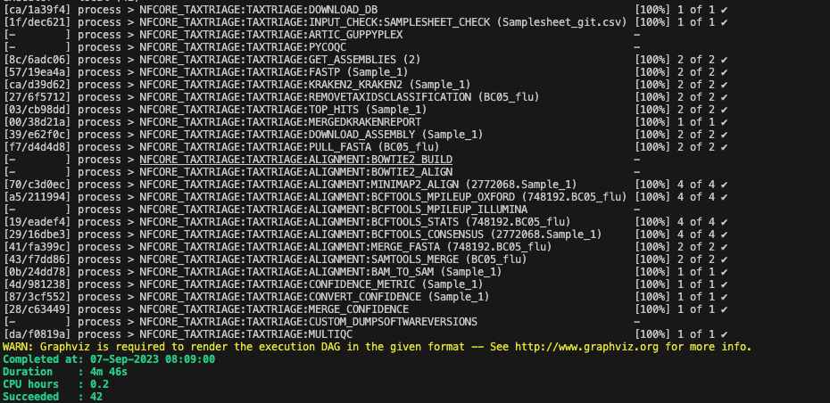


this will make a folder called `test_nfcore` in your `$HOME` directory. In there you will see an example output of `taxtriage` that will also contain a small kraken2 database and report file(s), consensus files, a multiqc report

The folder would look like: 

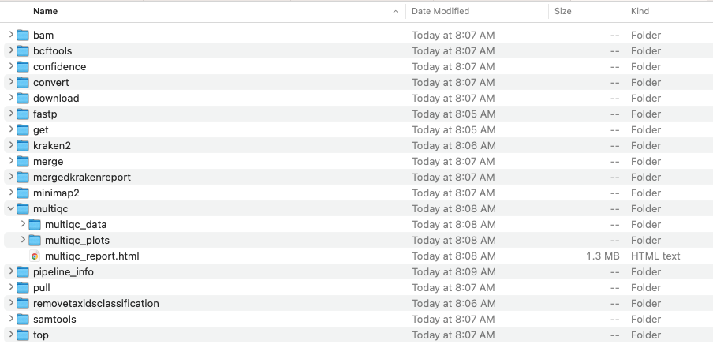


And the Report file, `multiqc/multiqc_report.html` will make some output files that look like 

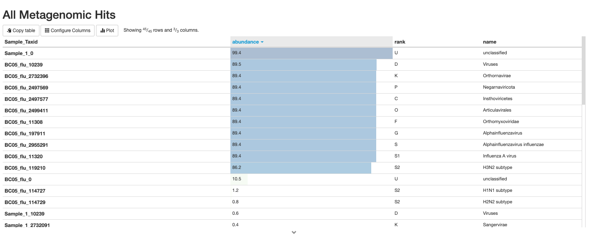
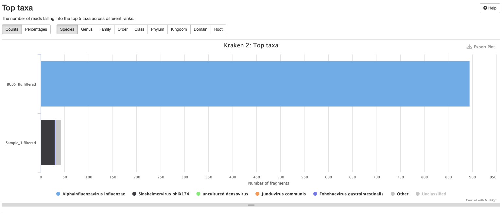


WARNING:

If you experience any "stalling" at certain areas, try to restart *Docker Desktop* after cancelling the job with `Ctrl` + `C`. You can also pass the `-resume` parameter like: `nextflow run https://github.com/jhuapl-bio/taxtriage -r main -profile test,docker --outdir ~/test_nfcore -resume` to pick up where you left off after cancelling. 


### Kraken2 databases

Now that we've run nextflow on a pre-made and tiny kraken2 database, we will download 3 more separately for use in the workshop. For these databases, we will be referencing them directly to show the differences in how the databases are able to report taxa

Download these databases to your `Desktop` or wherever you are the most comfortable. Remember the location for the workshop days

1. [standard-8](https://genome-idx.s3.amazonaws.com/kraken/k2_standard_08gb_20230605.tar.gz)
2. [viral](https://genome-idx.s3.amazonaws.com/kraken/k2_viral_20230605.tar.gz)
3. [flukraken2](https://media.githubusercontent.com/media/jhuapl-bio/mytax/master/databases/flukraken2.tar.gz)

### Test Data 

Download this zip folder [here](https://github.com/jhuapl-bio/datasets/archive/refs/heads/main.zip) - 140 MB
Also, if you dont have it from the previous workshop, get [this folder](https://drive.google.com/file/d/1zrgwheJxhMTvd7zu0fuRhVYYM0aGY5XS/view?usp=sharing) as well - ~500 MB

❗Be aware that the first is a GiHub repo which you can `git clone` as well with `git clone https://github.com/jhuapl-bio/datasets.git` and you can pull any changes down the line with `git clone`

## Basestack

Prerequisites: Docker

1. Go to [here](https://github.com/jhuapl-bio/Basestack/releases/latest)
2. Download the latest binary 
    a. Mac OSX: `.dmg`
    b. Windows (non-admin): `win-unpacked.zip`. You will need to extract/unzip and double click the `.exe` each time to run
    c. Windows (admin): `*Setup.exe`
    d. Linux: `AppImage`. Make sure to select `x86_64` (most cases for your laptop)
        - You will need to run `chmod +x` on the AppImage to allow it to be double-clickable. Otherwise run with `./Basestack.x86_64.AppImage`


### Images

Prerequisites: Docker

<!-- Show the imgs/LibraryBasestack.png file -->


Within Basestack, import (little blue button on the left side): 

1. `Pavian`
2. `Mytax Dashboard v2` 
3. `KrakenKrona`
4. `Kraken`
5. `Bowtie2`
6. `TaxTriage`


Then, you should see the icons appear on the left side (if you don't automatically get redirected). 

You will likely see a window appear (if you haven't already installed everything) that looks like:

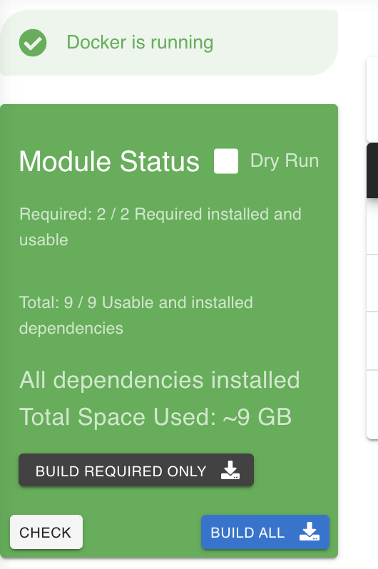

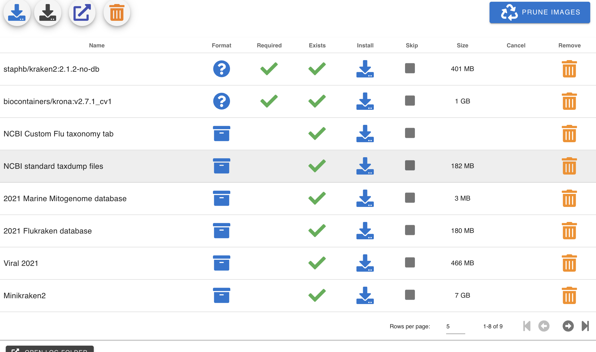

Simply select each of the blue download buttons to download everything, you should see the Orange box become green on the left-side when it is done

Be aware that, for Mac OSX Arm64 systems, there may be issues with the architecture in running these pipelines


## Conda 

Prerequisites: None

Ensure that you are INSIDE `WSL2` (see steps above to install). When running the script, select `Enter` or type `yes` when prompted

1. `WSL2` or `Linux`: 

```
cd $HOME
wget https://repo.anaconda.com/miniconda/Miniconda3-latest-Linux-x86_64.sh
bash Miniconda3-latest-Linux-x86_64.sh
```

2. `Mac OSX`

`arm64`

```
cd $HOME
wget https://repo.anaconda.com/miniconda/Miniconda3-latest-MacOSX-arm64.sh
bash Miniconda3-latest-MacOSX-arm64.sh
```

`amd64`

```
cd $HOME
wget https://repo.anaconda.com/miniconda/Miniconda3-latest-MacOSX-x86_64.sh
bash Miniconda3-latest-MacOSX-x86_64.sh
```

